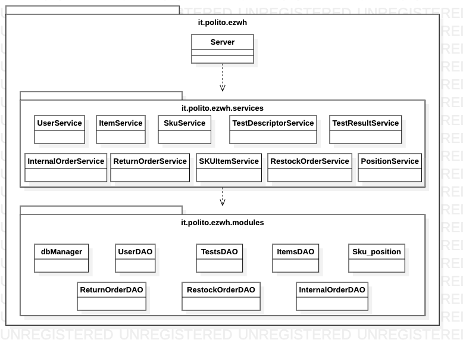
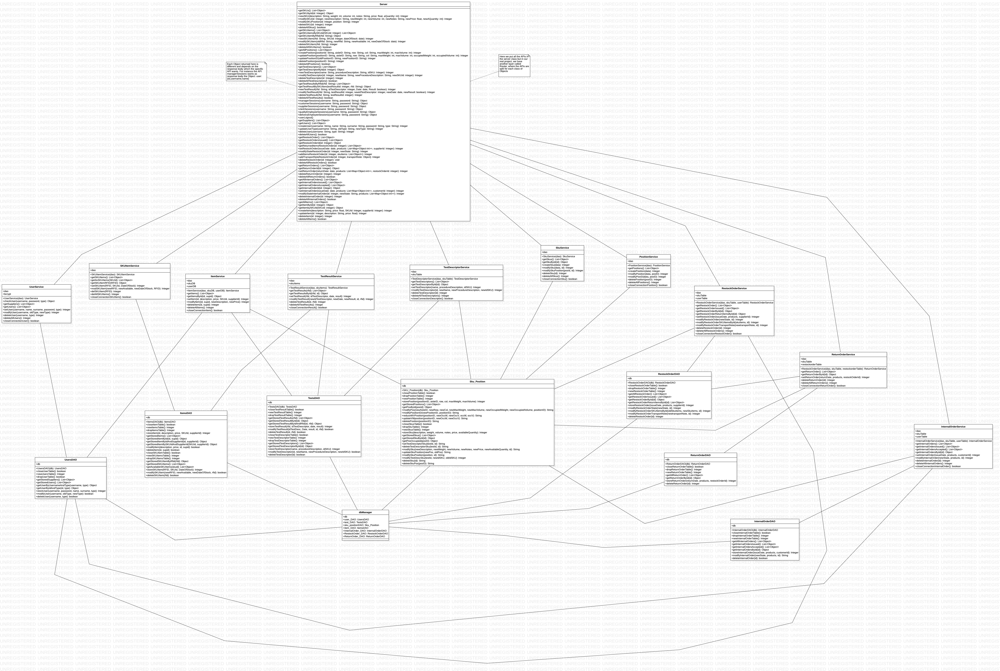

# Design Document 

Authors: Alessandro Tola, Emanuele Raimondo, Francesco Rosati, Fulvio Castello 

Date: 25/05/22

Version: 1.3

| Version number | Change |
| ----------------- |:-----------|
| 1.0 | Added traceability matrix and high level design diagram |
| 1.1 | Added low level design diagram |
| 1.2 | Added sequence diagrams and corrected formatting |
| 1.3 | Updated design version after the first release of code & spell checking |

# Contents

- [High level design](#package-diagram)
- [Low level design](#class-diagram)
- [Verification traceability matrices](#verification-traceability-matrices)
- [Verification sequence diagrams](#verification-sequence-diagrams)

# Instructions

The design must satisfy the Official Requirements document.

# High level design 

A three-layered architecture was the chosen implementation for the EZWH system, and it includes the following main packages:
- **Services**: manages all the logic of the EZWH application — the classes that belong to this package are the intermediate layer of the application
- **Modules**: processes all the data of the same application (DB interaction).

In addition, the *Server* class is just a façade, as the actual APIs for each class of *Objects* are included in another layer called *Router*. For the sake of simplicity, said APIs are here described inside the *Server* class.

## Package diagram

# Low level design

## Class diagram

Here, we decided to use the structural façade pattern for both the *Server* and the *dbManager* classes, so that the user can then interact with the system by means of the front-end side of the application. The latter invokes the correct functions through the *Server* class (and thus the related layers) in order to return the requested data to the client.

# Verification traceability matrices

## Dao traceability matrix

| FR  | Server | dbManager | UsersDAO | ItemsDAO | TestsDAO | SKU_Position | RestockOrderDAO | ReturnOrderDAO | InternalOrderDAO |  
| --- | :----: | :-------: | :------: | :------: | :------: | :----------: | :-------------: | :------------: | :--------------: |
| FR1 | x | x | x | | | | | | |
| FR2 | x | x | | | | x | | | | 
| FR3 | x | x | | | x | x | | | |
| FR4 | x | x | x | | | | | | |
| FR5 | x | x | x | x | x | x | x | x | |
| FR6 | x | x | | x | | x | | | x |
| FR7 | x | x | | x | | | | | |

## Service traceability matrix

| FR  | UserService | SKUItemService | ItemService | TestResultService | TestDescriptorService | SkuService | PositionService | RestockOrderService | ReturnOrderService | InternalOrderService |
| --- | :---------: | :------------: | :---------: | :---------------: | :-------------------: | :--------: | :-------------: | :-----------------: | :----------------: | :------------------: |
| FR1 | x | | | | | | | | | |
| FR2 | | | | | | x | | | | |
| FR3 | | | | x | x | x | x | | | |
| FR4 | x | | | | | | | | | |
| FR5 | x | x | | x | x | x | x | x | x | |
| FR6 | | x | | | | x | | | | x |
| FR7 | x | | x | | | x | | | | |

# Verification sequence diagrams 

In the following, the instantiations of the *dbManager* and of all the classes which appear in the sequence diagrams are assumed to have already been performed.

## Use case 2 - Scenario 5 (Delete Position)

.png)

## Use case 4 - Scenario 2 (Modify User Rights)

.png)

## Use case 12 - Scenario 2 (Update Test Descriptor)

.png)
