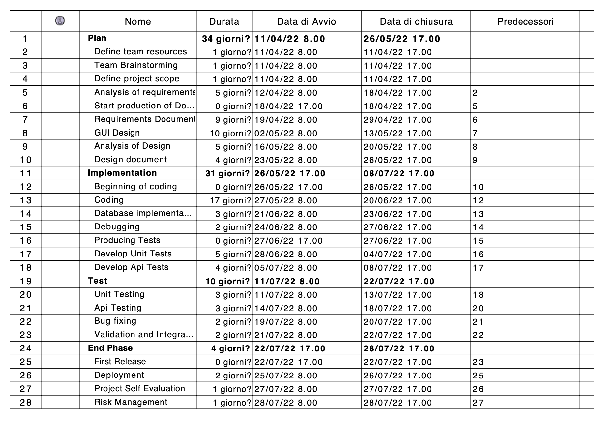
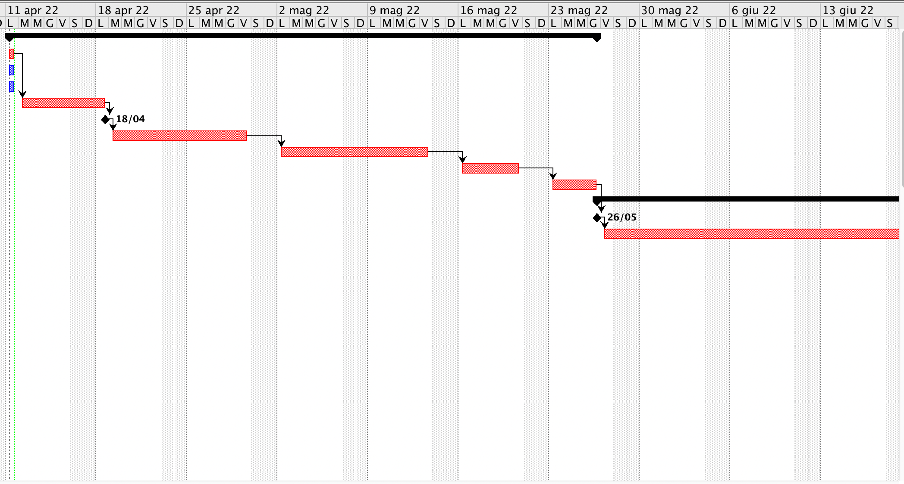
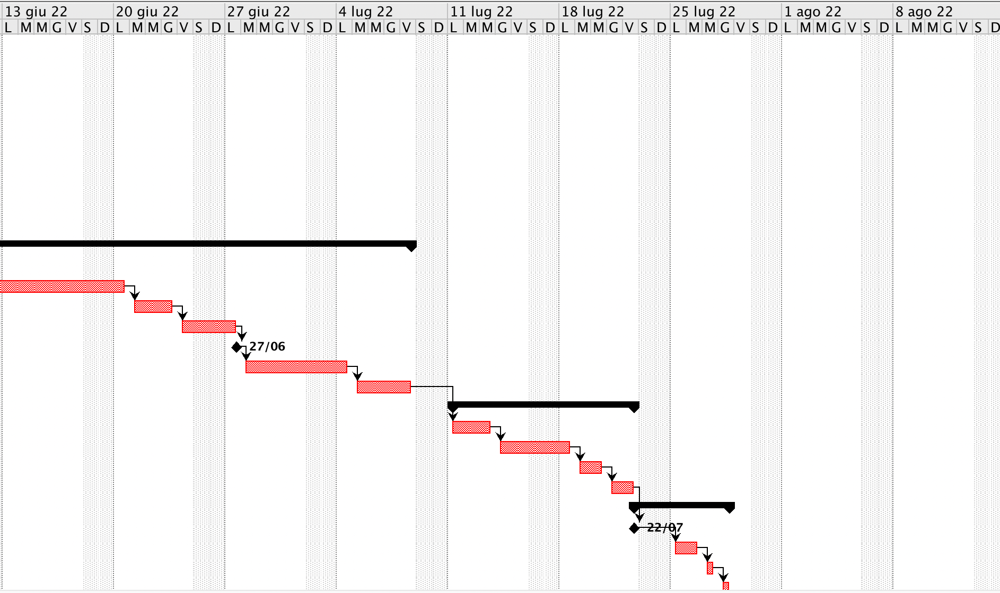

# Project Estimation 

Authors: Alessandro Tola, Emanuele Raimondo, Francesco Rosati, Fulvio Castello 

Date: 09/04/2022

Version: 1.0

# Estimation approach

# Estimate by size
### 
|             | Estimate                        |             
| :----------- | :-------------------------------: |  
| NC = Estimated number of classes to be developed |           10             |             
|  A = Estimated average size per class, in LOC       |         250                   | 
| S = Estimated size of project, in LOC (= NC * A) | 2500 |
| E = Estimated effort, in person hours (here use productivity 10 LOC per person hour)  |        250 Person Hours                              |   
| C = Estimated cost, in euro (here use 1 person hour cost = 30 euro) | 7500 euro | 
| Estimated calendar time, in calendar weeks (Assume team of 4 people, 8 hours per day, 5 days per week ) |    250 / (4*8) = 7.8 days = 1 week + 3 days                |               

# Estimate by product decomposition
### 
|         Component name    | Estimated effort (person hours)   |             
| :----------- | :-------------------------------: | 
| Requirement document    | 120 |
| GUI prototype | 80 |
| Design document | 70 |
| Code | 200 |
| Unit tests | 60 |
| Api tests | 40 |
| Management documents  | 15 |
| **Total** | 585 |

# Estimate by activity decomposition
### 
|         Activity name    | Estimated effort (person hours)   |             
| :----------- | :-------------------------------: | 
| ___Plan___ | Tot: 278 |
| Define team resources | 5 |
| Team Brainstorming | 3 |
| Define project scope | 10 |
| Analysis of requirements | 40 |
| Requirements Document | 70 |
| GUI Design | 80 |
| Analysis of Design | 40 |
| Design document| 30 |
| ___Implementation___ | Tot: 225 |
| Coding | 130 |
| Database implementation | 15 |
| Debugging | 10 |
| Develop Unit Tests | 40 |
| Develop API Tests | 30 |
| ___Test___ | Tot: 60 |
| Unit Testing | 20 |
| Api Testing | 15 |
| Bug fixing | 15 |
| Validation and Integration | 10 |
| ___End Phase___ | Tot: 20 |
| Deployment | 5 | 
| Project Self Evaluation | 5 |
| Risk Management | 10 | 
| **Total** | 583 |

###

 

# Summary

|             | Estimated effort                        |   Estimated duration |          
| :----------- | :-------------------------------: | :---------------: |
| Estimate by size | 250 Person Hours | 7.8 days = 1 week + about 3 days |
| Estimate by product decomposition | 585 Person Hours | 18.3 days = 3 week + about 4 days |
| Estimate by activity decomposition | 583 Person Hours | 18.2 days = 3 week + about 4 days |

In our opinion, these estimations (by size, by product decomposition, by activity decomposition) are not so realistic because here we are considering that the four teammates are working always at the same time and with a productivity of 100%: that's of course not always true.
In any case, we observed that the outcomes differ by a small margin: this happens because the estimation by size isn't too accurate, as it just considers the total lines of code instead of taking into account the whole project development process. 
