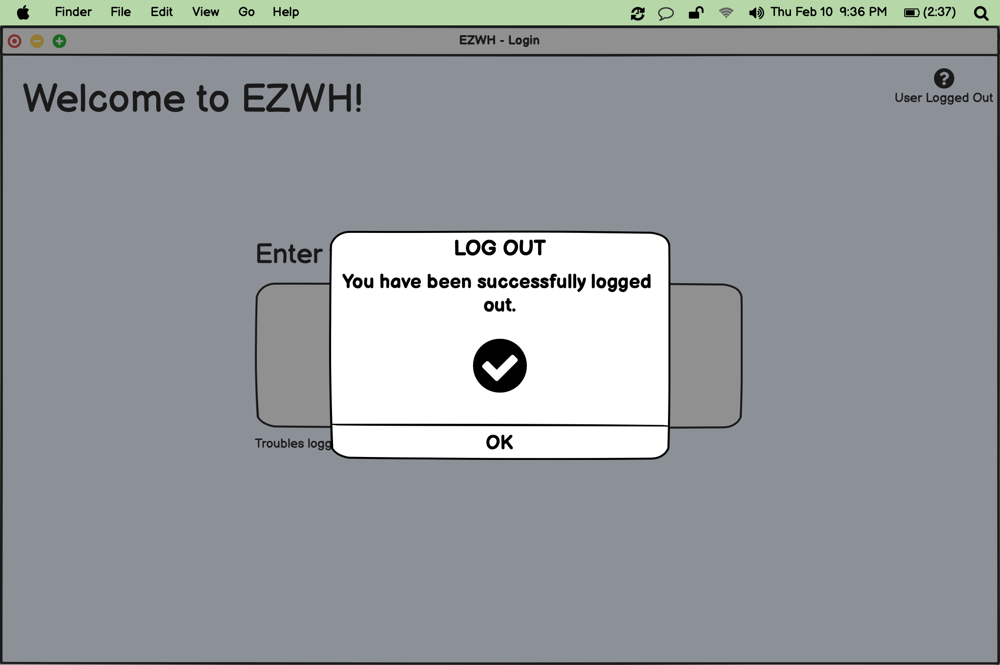

# Graphical User Interface Prototype  

Authors: Alessandro Tola, Emanuele Raimondo, Francesco Rosati, Fulvio Castello 

Date: 13/04/2022

Version: 1.0

## GUI elements sorted by use case/scenario:

### Use case 1, Manage warehouse

#### Scenario 1.1 (Create warehouse)

#### Scenario 1.2 (Edit warehouse)

### Use case 2, Manage user

#### Scenario 2.1 (Create user and define its permissions)

#### Scenario 2.2 (Delete user)

#### Scenario 2.3 (Modify user permissions)

#### Scenario 2.4 (Exceptional scenario)

### Use case 3, Manage item

#### Scenario 3.1 (Create new item)

#### Scenario 3.2 (Edit item features)

#### Scenario 3.3 (Delete item)

#### Scenario 3.4 (Exceptional scenario)

### Use case 4, Manage internal order

#### Scenario 4.1 (Create new internal order)

#### Scenario 4.2 (Close internal order)

#### Scenario 4.3 (Edit internal order)

#### Scenario 4.4 (Revoke internal order)

#### Scenario 4.5 (Exceptional scenario)

#### Scenario 4.6 (Exceptional scenario)

### Use case 5, Manage supplier

#### Scenario 5.1 (Create supplier)

#### Scenario 5.2 (Delete supplier)

#### Scenario 5.3 (Change informations about supplier)

#### Scenario 5.4 (Exceptional scenario)

### Use case 6, Manage external order

#### Scenario 6.1 (Create external order)

#### Scenario 6.2 (Revoke external order)

#### Scenario 6.3 (Reject external order)

#### Scenario 6.4 (Accept external order)

### Use case 7, Manage test on item

#### Scenario 7.1 (External order EO is accepted)

#### Scenario 7.2 (Exceptional scenario)

### Use case 8, Login and logout

#### Scenario 8.1 (User login)

#### Scenario 8.2 (Wrong user credentials)

#### Scenario 8.3 (User logout)

