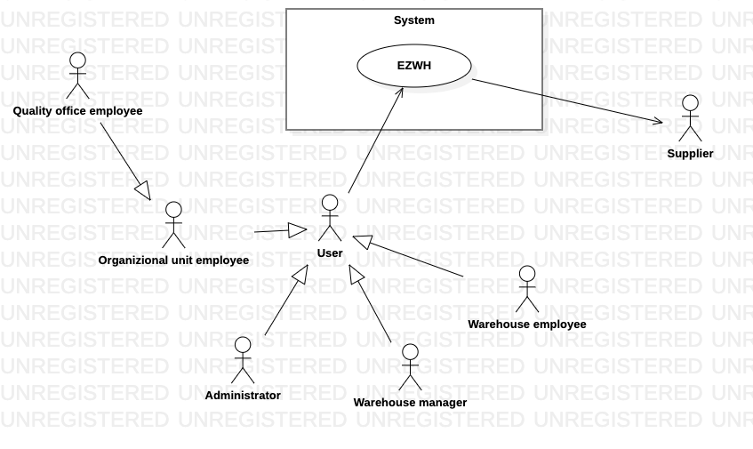
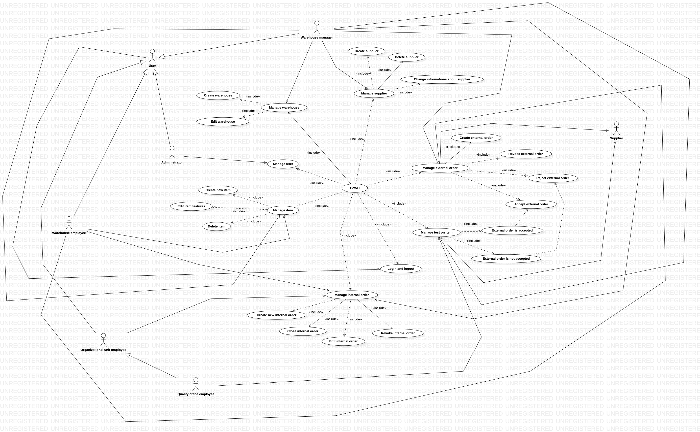
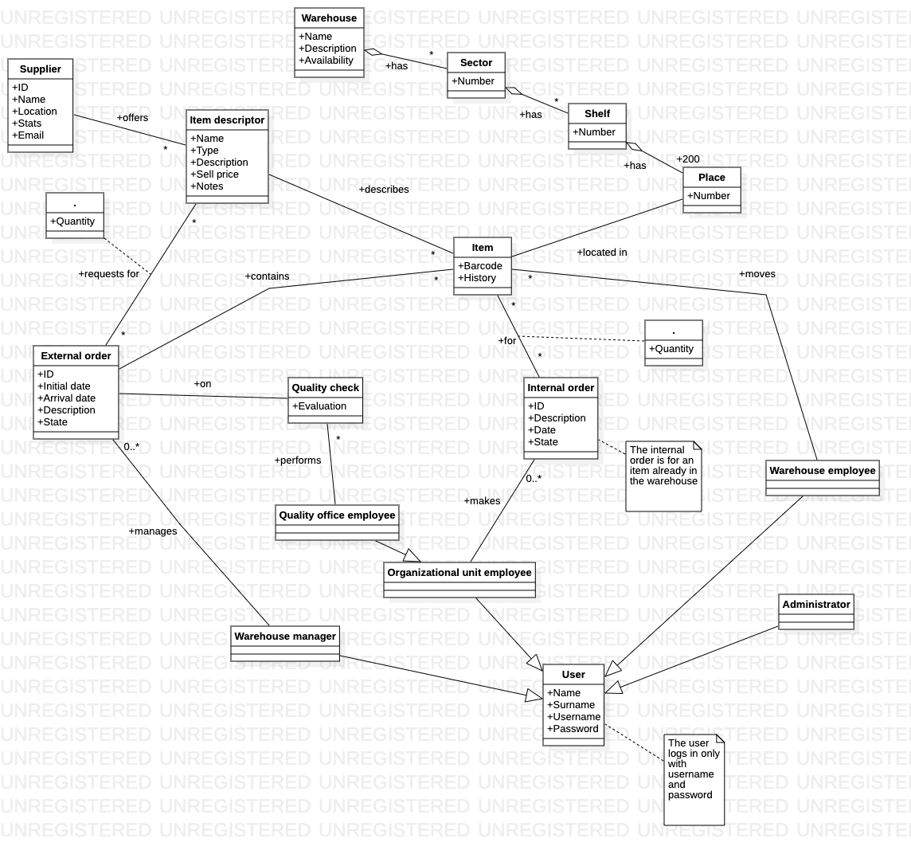
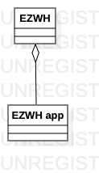
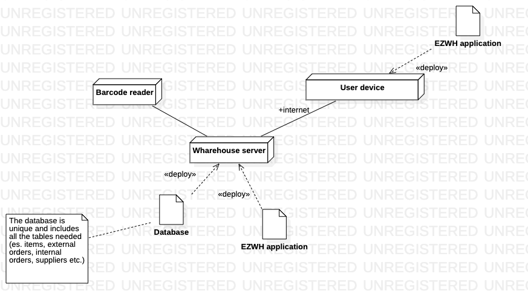

 #Requirements Document

Authors: Alessandro Tola, Emanuele Raimondo, Francesco Rosati, Fulvio Castello 

Date: 13/04/2022

Version: 1.7
 
| Version number | Change |
| ----------------- |:-----------|
| 1.1 | Added the main functional requirements |
| 1.2 | Added the main non functional requirements |
| 1.3 | Added the main use cases |
| 1.4 | Added the system design and the deployment diagram |
| 1.5 | Added use case diagram and glossary |
| 1.6 | Modified use cases, use case diagram and glossary |
| 1.7 | Corrected spelling and finalized document |

# Contents

- [Informal description](#informal-description)
- [Stakeholders](#stakeholders)
- [Context Diagram and interfaces](#context-diagram-and-interfaces)
	+ [Context Diagram](#context-diagram)
	+ [Interfaces](#interfaces) 
	
- [Stories and personas](#stories-and-personas)
- [Functional and non functional requirements](#functional-and-non-functional-requirements)
	+ [Functional Requirements](#functional-requirements)
	+ [Non functional requirements](#non-functional-requirements)
- [Use case diagram and use cases](#use-case-diagram-and-use-cases)
	+ [Use case diagram](#use-case-diagram)
	+ [Use cases](#use-cases)
		+ [Use case 1](#use-case-1-manage-warehouse)
		+ [Use case 2](#use-case-2-manage-user)
		+ [Use case 3](#use-case-3-manage-item)
		+ [Use case 4](#use-case-4-manage-internal-order)
		+ [Use case 5](#use-case-5-manage-supplier)
		+ [Use case 6](#use-case-6-manage-external-order)
		+ [Use case 7](#use-case-7-manage-test-on-item)
		+ [Use case 8](#use-case-8-login-and-logout)
- [Glossary](#glossary)
- [System design](#system-design)
- [Deployment diagram](#deployment-diagram)

# Informal description
Medium companies and retailers need a simple application to manage the relationship with suppliers and the inventory of physical items stocked in a physical warehouse. 
The warehouse is supervised by a manager, who supervises the availability of items. When a certain item is in short supply, the manager issues an order to a supplier. In general the same item can be purchased by many suppliers. The warehouse keeps a list of possible suppliers per item. 

After some time the items ordered to a supplier are received. The items must be quality checked and stored in specific positions in the warehouse. The quality check is performed by specific roles (quality office), who apply specific tests for item (different items are tested differently). Possibly the tests are not made at all, or made randomly on some of the items received. If an item does not pass a quality test it may be rejected and sent back to the supplier. 

Storage of items in the warehouse must take into account the availability of physical space in the warehouse. Further the position of items must be traced to guide later recollection of them.

The warehouse is part of a company. Other organizational units (OU) of the company may ask for items in the warehouse. This is implemented via internal orders, received by the warehouse. Upon reception of an internal order the warehouse must collect the requested item(s), prepare them and deliver them to a pick up area. When the item is collected by the other OU the internal order is completed. 

EZWH (EaSy WareHouse) is a software application to support the management of a warehouse.

# Stakeholders

| Stakeholder name  | Description | 
| ----------------- |:----------- |
| Company | The company who decides to buy the EZWH application |
| Warehouse manager | Who supervises the company warehouse | 
| Warehouse employee | Who is in charge of set and pick up items |
| Supplier | Who is responsible for selling the items |
| Developer | Who is in charge of developing the EZWH application |
| Administrator | Who administrates the application |
| Competitor | Who is in competition with the standard supplier |
| Quality office employee | Who is in charge of testing items |
| Financer | Who is in charge of financing the development of the EZWH application |
| User | The employee of the warehouse which uses the EZWH app |
| Organizational unit employee | Who asks for item(s) in the warehouse |

# Context Diagram and interfaces

## Context Diagram

## Interfaces

| Actor | Logical Interface | Physical Interface  |
| ------------- |:-------------:| :-----|
| User | GUI | Screen, keyboard, mouse on pc, internet connection |
| Warehouse employee | GUI | Barcode reader, screen, keyboard, mouse on pc, internet connection |
| Administrator | GUI | Screen, keyboard, mouse on pc, internet connection |
| Supplier | Send / receive email | internet connection |

# Stories and personas

## Personas

- James is a 30 y/o Warehouse Employee. He is married with Charlotte and has got 2 kids. He wakes up very early in the morning, typically at 6:00 AM, and goes to work at 7:30 AM. He is very accurate and careful and the manager trusts him a lot.

- Noah is 40 y/o and he is been an Administrator for the company for the last 5 years. He is divorced and has no children. He is very devoted to his job and he often spends extra hours at work. He is very outgoing and makes everyone who works with him very comfortable.

- Sophia is a 45 y/o Warehouse Manager. She works really hard to maintain her family. She wakes up early in the morning because she has to take her daughter to school before going to work. She always tries to find new ways to improve her work. She always tries to help people who are in need. 

- Benjamin is 50 y/o. He has always worked as Supplier for warehouses. He's a very extroverted person and likes to stay in public places and to talk with people. Benjamin has a dog called Peanut. He loves going to the beach with Peanut as soon as he finishes his turn around 5:00 PM.

- William is 25 y/o and works as a Quality Office Employee. This is his first job but he is already very skilled in doing what his task requires. He lives with his parents but he is trying to save some money to move out. He is a very sporty person, and in fact goes for a run every morning before going to work.

- Isabella is 30 y/o and works as Organizational Unit Employee. She is very introverted but also very gentle with other people. When she has to do a task she prefers to do it all by herself, she doesn't like cooperating too much. She is not married but loves a man called Robert.

## Stories

- James is very sensitive about pollution and he tries not to use the car whenever he can. In fact, in the warmer seasons he always rides his bike to the warehouse along with his long term friend Mark. He spends most of his time inspecting items on the shelves and collecting them in order to finalize internal orders.

- Sophia wakes up every day at 6:30 AM, goes to work at 7:30 AM and stays there until 5:30 PM. Her work is the key to the proper functioning of the entire warehouse. She is involved in all of the most important tasks cooperating with warehouse employees, organizational unit employees and quality office employees.

- Benjamin's typical work day can change very often. His task is to speak and stay in contact with the various warehouses with which he previously made agreements. He is always ready to receive a new order from a warehouse manager that is in short supply of some items.

- William doesn't own a car so he goes to work by taking public transport, so it happens that sometimes he arrives late. When he arrives late he always stays longer during the afternoon in order to catch up with what he hasn't done in the morning. He always manages to finish the quality check for all the items of the day with in-depth tests.

- Isabella works in one Organizational Unit (OU) of the company. She is in charge of making the internal orders for her OU. Every day she wakes up at 7:30 AM and arrives at work at 8:30 AM, where she always finds some orders from other OU arrived the previous evening. She is usually very precise in creating new orders, keeping track of the state of the orders and checking that all the quantities are correct.

# Functional and non functional requirements

## Functional Requirements

| ID        | Description  |
| ------------- |:-------------| 
| FR1 | Manage warehouse |
| FR1.1 | Create and configure warehouse |
| FR1.1.1 | Define number of sectors and number of shelves per sector |
| FR1.2 | Edit configuration of warehouse |
| FR1.2.1 | Edit name and description of warehouse |
| FR1.2.2 | Edit number of sectors and / or number of shelves per sector |
| FR2 | Manage user |
| FR2.1 | Create new user profile |
| FR2.2 | Generate password for user profile |
| FR2.3 | Edit user profile, modify user permissions |
| FR2.4 | Search user by username |
| FR2.5 | Delete user profile |
| FR3 | Manage item |
| FR3.1 | Create new item (name, type) |
| FR3.2 | Generate internal barcode |
| FR3.3 | Define shelf, place of stock and define quantity |
| FR3.4 | Search item (by barcode, by type, by name) | 
| FR3.5 | Show list of items |
| FR3.5.1 | Show list of items sorted by quantity in stock |
| FR3.6 | Edit item features |
| FR3.7 | Delete item |
| FR4 | Manage internal order |
| FR4.1 | Create new internal order |
| FR4.2 | Edit internal order |
| FR4.3 | Show list of internal orders |
| FR4.4 | Edit state of internal order |
| FR4.5 | Search internal order |
| FR4.6 | Show availability of requested item(s) |
| FR4.6.1 | Show position of requested item(s) |
| FR4.7 | Notify employee about new order |
| FR4.8 | Delete internal order |
| FR5 | Manage supplier |
| FR5.1 | Create new supplier |
| FR5.2 | Search supplier |
| FR5.3 | Define type of items sold by supplier |
| FR5.4 | Show list of accepted order(s) |
| FR5.4.1 | Show evaluation about supplier |
| FR5.5| Delete supplier |
| FR6 | Manage order to supplier (external order) |
| FR6.1 | Create new order |
| FR6.2 | Choose item descriptor, define quantity |
| FR6.3 | Search external order |
| FR6.4 | Revoke order |
| FR6.5 | Reject order |
| FR6.6 | Accept order |
| FR6.6.1 | Notify employee about order accepted |
| FR7 | Manage test on item |
| FR7.1 | Record arrival of order |
| FR7.2 | Select order to which the item belongs and add evaluation |
| FR7.3 | Update evaluation of supplier (% computed from orders accepted / orders issued) |
| FR8 | Manage user login and logout |
| FR8.1 | Login |
| FR8.2 | Logout |

## Non Functional Requirements

| ID | Type (efficiency, reliability, ..) | Description | Refers to |
| ------------- |:-------------:| :-----:| -----:|
| NFR1 | Usability | No training required for any user | All FR |
| NFR2 | Portability | The application should be developed for the most commonly used desktop OS (Windows, Mac OS, Linux) | All FR |
| NFR3 | Efficiency | Response time after any action less than 0.1 s | All FR |
| NFR4 | Privacy | The data of the user should never leave the application | All FR |
| NFR5 | Security | The data must be shared only with the same class of users | All FR | 
| NFR6 | Robustness | Time to restart after failure < 1 s | All FR |
| NFR7 | Domain | The barcode number of an item should be a number on 12 to 14 digits according to GTIN specifications | All FR | 
| NFR8 | Size | Manage a maximum of 5000 item types | FR3 |
| NFR9 | Size | Manage only one active configuration of warehouse | FR1 |
| NFR10 | Size | The number of places per shelf is 200 | FR1 |
| NFR11 | Domain | The generated password should be a string of 16 characters, including symbols, numbers, uppercase and lowercase characters | FR2 |

# Use case diagram and use cases

## Use case diagram

In the use case diagram we put all the use cases but only the more representative scenarios. The complete analysis of use cases with all the scenarios is reported below:

## Use cases

### Use case 1, Manage warehouse

| Actors Involved | Warehouse manager |
| ------------- |:-------------| 
| Precondition | Warehouse manager logged in |
| Post condition | New warehouse created or updated |
| Nominal Scenario | Warehouse manager creates new warehouse and defines its configuration |
| Variants | Warehouse already exists and warehouse manager modifies only the configuration |

#### Scenario 1.1

| Scenario 1.1 | Create warehouse |
| ------------- |:-------------| 
| Precondition | Warehouse manager logged in, warehouse X doesn't exist in the system |
| Post condition | New warehouse X created and configuration defined |
| Step# | Description |
| 1 | Warehouse manager inserts new warehouse name and description |
| 2 | Warehouse manager inserts number of sectors in the warehouse |  
| 3 | Warehouse manager inserts number of shelves per sector |
| 4 | Warehouse manager confirms inserted data |

#### Scenario 1.2

| Scenario 1.2 | Edit warehouse |
| ------------- |:-------------| 
| Precondition | Warehouse manager logged in |
| | Warehouse X exists in the system |
| Post condition | Configuration of warehouse X updated |
| Step# | Description |
| 1 | Warehouse manager selects warehouse X |  
| 2 | Warehouse manager modifies configuration of warehouse X (number of sectors, number of shelves per sector) |
| 3 | Warehouse manager confirms inserted data |

### Use case 2, Manage user

| Actors Involved | Administrator A |
| ------------- |:-------------| 
| Precondition | A is logged in |
|| Account AC of user U doesn't exist in the system |
| Post condition | Account AC of user U created or updated |
| Nominal Scenario | A creates a new account AC for user U with credentials and defines its permissions |
| Variants | A deletes account AC of user U |
|| A modifies permissions of user U |
| Exceptions | Username of user U already exists in the system |

#### Scenario 2.1

| Scenario 2.1 | Create user and define its permissions |
| ------------- |:-------------| 
| Precondition | Administrator A is logged in |
| Post condition | Account AC for user U is created |
| Step# | Description |
| 1 | A define credentials of the new Account AC |  
| 2 | A selects and gives the correct access permissions to AC |
| 3 | The system checks that account AC of user U doesn't exist in the system |
| 4 | The system generates a password for user U |
| 5 | A confirms inserted properties |

#### Scenario 2.2

| Scenario 2.2 | Delete user |
| ------------- |:-------------| 
| Precondition | Administrator A is logged in |
|| User U exists |
| Post condition | Account for user U is deleted |
| Step# | Description |
| 1 | A searches for user by username |
| 2 | A selects the user account AC he wants to delete |
| 3 | AC of user U is deleted from the system |

#### Scenario 2.3

| Scenario 2.3 | Modify user permissions |
| ------------- |:-------------| 
| Precondition | Administrator A is logged in | 
|| User U exists in the system |
| Post condition | Account of user U is updated in the system |
| Step# | Description |
| 1 | Administrator A search user U by username |
| 2 | Administrator A selects user U |
| 3 | A changes user's permissions for U |
| 4 | A confirms the new permissions |

#### Scenario 2.4 (Exceptional scenario)

| Scenario 2.4 | Account AC of user U already exists in the system |
| ------------- |:-------------| 
| Precondition | Administrator A is logged in |
| Post condition | Account AC of user U created with a different username |
| Step# | Description |
| 1 | A define credentials of the new Account AC |  
| 2 | A selects and gives the correct access permissions to AC |
| 3 | The system checks that username of user U doesn't exist in the system yet |
| 4 | The system doesn't allow submission of inserted properties |

### Use case 3, Manage item

| Actors Involved  | Warehouse manager WM, warehouse employee WE |
| ------------- |:-------------| 
| Precondition | WM and WE are logged in |
| Post condition | |
| Nominal Scenario | WM or WE creates new item, defines its fields (name, type etc.), its quantity and place |
| Variants | Item already exists, WM or WE modifies only quantity or place |
|| WM or WE deletes item from the system |
| Exceptions | The place assigned to the new item is not available (warning) |

#### Scenario 3.1

| Scenario 3.1 | Create new item |
| ------------- |:-------------| 
| Precondition | WM or WE is logged in |
| Post condition | New item I is created |
| Step# | Description |
| 1 | WM or WE creates new item |
| 2 | WM or WE inserts item informations |
| 3 | WM or WE defines shelf |
| 4 | WM or WE defines place of shelf |
| 5 | The system checks that place at shelf is empty |
| 6 | The system generates an internal barcode associated to I |
| 7 | A confirms inserted data |

#### Scenario 3.2

| Scenario 3.2 | Edit item features |
| ------------- |:-------------| 
| Precondition | WM or WE is logged in |
|| Item I exists in the system |
| Post condition | Item I is updated in the system |
| Step# | Description |
| 1 | WM or WE searches for I |
| 2 | WM or WE selects I |
| 3 | WM or WE edits I's informations (shelf, place, quantity etc.) |
| 4 | The system checks that place at shelf is empty |
| 5 | WM or WE confirms inserted data |

#### Scenario 3.3

| Scenario 3.3 | Delete item |
| ------------- |:-------------| 
| Precondition | WM or WE is logged in |
|| Item I exists in the system |
| Post condition | Item I is deleted from the system |
| Step# | Description |
| 1 | WM or WE searches for I |
| 2 | WM or WE selects I |
| 3 | WM or WE confirms deletion |
| 4 | I is deleted from the system |

#### Scenario 3.4 (Exceptional scenario)

| Scenario 3.4 | Place assigned to item I is not available on creation |
| ------------- |:-------------| 
| Precondition | WM or WE is logged in |
|| Item I does not exist in the system |
| Post condition | Item I is not created |
| Step# | Description |
| 1 | WM or WE creates new item |
| 2 | WM or WE inserts item informations |
| 3 | WM or WE defines shelf |
| 4 | WM or WE defines place of shelf |
| 5 | The system checks that place at shelf is empty |
| 6 | The system issues a warning because the place at the shelf is not available |

### Use case 4, Manage internal order

| Actors Involved | Organizational unit employee OUE, warehouse employee WE, warehouse manager WM |
| ------------- |:-------------| 
| Precondition | OUE, WM and WE logged in |
| Post condition | Internal order IO is created or its state is updated |
| Nominal Scenario | OUE creates a new internal order |
| Variants | OUE edits the order |
|| WE closes the order |
|| OUE revokes the order |
| Exceptions | Item ordered doesn't exist, issue a warning |
|| Item quantity in warehouse is not enough, issue a warning |

**INTERNAL ORDER STATES**
- **Created**: order created or updated
- **Ready**: order in the pick up area and closed
- **Canceled**: order canceled

#### Scenario 4.1

| Scenario 4.1 | Create new internal order IO |
| ------------- |:-------------| 
| Precondition | OUE logged in |
|| Internal order IO doesn't exist in the system |
| Post condition | Internal order IO in state CREATED |
| Step# | Description |
| 1 | OUE creates a new IO | 
| 2 | OUE searches for item I by barcode, name or type |
| 3 | OUE defines quantity of I |
| 4 | System checks item I availability |
| 5 | OUE confirms inserted data |
| 6 | IO passes to state CREATED |
| 7 | System notifies WE about new order (barcode, item type, item name, position, required quantity, current quantity) |

#### Scenario 4.2

| Scenario 4.2 | Close internal order IO |
| ------------- |:-------------| 
| Precondition | WE logged in |
|| Internal order IO exists in the system and is in state CREATED |
| Post condition | Internal order IO in state READY |
| 1 | WE searches for IO by state CREATED |
| 2 | WE collects and scans items with barcode reader |
| 3 | WE puts items requested into pick up area |
| 4 | WE changes the order state in READY and the system updates the current item's quantity in stock |

#### Scenario 4.3

| Scenario 4.3 | Edit internal order IO |
| ------------- |:-------------| 
| Precondition | OUE, WE logged in |
|| Internal order IO exists in the system |
| Post condition | Internal order IO in state CREATED |
| Step# | Description |
| 1 | OUE searches for IO |
| 2 | OUE edits IO |
| 3 | OUE confirms inserted data |
| 4 | IO passes to state CREATED |
| 5 | System notifies WE |

#### Scenario 4.4

| Scenario 4.4 | Revoke internal order IO |
| ------------- |:-------------| 
| Precondition | OUE logged in |
|| Internal order IO exists in the system |
| Post condition | Internal order IO is in state CANCELED |
| Step# | Description |
| 1 | OUE searches for IO |
| 2 | OUE confirms revoke action |
| 3 | IO passes to state CANCELED |

#### Scenario 4.5 (Exceptional scenario)

| Scenario 4.5 | Item ordered doesn't exist |
| ------------- |:-------------| 
| Precondition | OUE logged in |
|| Item I inserted in internal order IO doesn't exist in the system |
| Post condition | Warning issued, IO not created |
| Step# | Description |
| 1 | OUE creates a new IO | 
| 2 | OUE searches for item I by barcode, name or type |
| 3 | System issues a warning because item I doesn't exist |

#### Scenario 4.6 (Exceptional scenario)

| Scenario 4.6 | Item ordered is not available |
| ------------- |:-------------| 
| Precondition | OUE logged in |
|| Quantity of item I inserted in internal order IO is not available |
| Post condition | Warning issued, IO not created |
| Step# | Description |
| 1 | OUE creates a new IO | 
| 2 | OUE searches for item I by barcode, name or type |
| 3 | OUE defines quantity of I |
| 4 | System checks item I availability |
| 5 | System issues a warning because quantity of item I is not available |

### Use case 5, Manage supplier

| Actors Involved | Warehouse manager WM |
| ------------- |:-------------| 
| Precondition | WM is logged in |
| Post condition | Supplier S created or updated |
| Nominal Scenario | WM creates new supplier S |
| Variants | WM deletes S from the system |
|| WM changes informations about S |
| Exceptions | S already exists in the system |

**Notes:**
An external order is completely managed by email so there is no need to have a complete updated catalogue for each supplier of every item sold. We specify every supplier with just the type of the items he sells.

When an external order is issued, the warehouse manager chooses the supplier, defines items and quantity basing on the internal instance of the items. Successively, the system automatically sends a request for those items via email to the supplier, which will check on his catalogue the availability of items (items descriptors) requested and responses with an offer. The warehouse manager will always accept or refuse the offer via email.

See use case 6 for a more detailed description of how external orders work.

#### Scenario 5.1

| Scenario 5.1 | Create supplier S |
| ------------- |:-------------| 
| Precondition | Warehouse manager WM is logged in |
|| Supplier S doesn't exist in the system |
| Post condition | Supplier S is created |
| Step# | Description |
| 1 | WM creates the new supplier S |
| 2 | WM inserts informations about S |
| 3 | WM defines type of items sold by S |
| 4 | System checks if S already exists |
| 5 | WM confirms inserted data |

#### Scenario 5.2

| Scenario 5.2 | Delete supplier S |
| ------------- |:-------------| 
| Precondition | Warehouse manager WM is logged in | 
|| Supplier S exists in the system |
| Post condition | Supplier S is deleted from the system |
| Step# | Description |
| 1 | WM searches for S |
| 2 | WM selects S |
| 3 | WM confirms deletion |
| 4 | S is deleted from the system |

#### Scenario 5.3

| Scenario 5.3 | Change informations about supplier S |
| ------------- |:-------------| 
| Precondition | Warehouse manager WM is logged in |
|| Supplier S exists in the system |
| Post condition | Supplier S is updated in the system |
| Step# | Description |
| 1 | WM searches for S |
| 2 | WM selects S |
| 3 | WM changes informations about S |
| 4 | WM confirms the newly inserted informations |

#### Scenario 5.4 (Exceptional scenario)

| Scenario 5.4 | Create supplier S already existing in the system |
| ------------- |:-------------| 
| Precondition | Warehouse manager WM is logged in, supplier S exists in the system |
| Post condition | New supplier S not created |
| Step# | Description |
| 1 | WM creates the new supplier S |
| 2 | WM inserts informations about S |
| 3 | WM confirms the inserted data |
| 4 | System checks if S already exists |
| 5 | System raises an error |

### Use case 6, Manage external order

| Actors Involved | Warehouse manager WM, Warehouse employee WE, Supplier S |
| ------------- |:-------------| 
| Precondition | WM logged in |
| Post condition | New external order EO is created or its state is updated |
| Nominal Scenario | WM performs an external order EO (through email) |
| Variants | WM revokes an external order EO |
|| WM accepts checked external order EO |
|| WM reject checked external order EO |

**EXTERNAL ORDER STATES**
- **Created**: Order created or updated
- **Waiting**: Order delivered but not checked 
- **Ready**: Order delivered and checked
- **Accepted**: Order checked, accepted and closed
- **Rejected**: Order checked and not accepted
 
#### Scenario 6.1

| Scenario 6.1 | Create external order EO to supplier S |
| ------------- |:-------------| 
| Precondition | WM logged in |
|| S exists in the system |
|| EO does not exists in the system |
| Post condition | New EO created, passed to CREATED state and email to supplier S sent |
| Step# | Description |
| 1 | WM analyzes item availability history and decides to order an item |
| 2 | WM chooses supplier S in base of evaluation |
| 3 | WM create new external order EO |
| 4 | WM defines item type, item name, quantity |
| 5 | WM confirms inserted data |
| 6 | System automatically sends an ORDER email to supplier S |
| 7 | EO passes to CREATED state |

#### Scenario 6.2

| Scenario 6.2 | Revoke external order EO |
| ------------- |:-------------| 
| Precondition | WM logged in |
|| External order EO to supplier S exists in the system |
| Post condition | External order EO to supplier S is deleted from the system |
| Step# | Description |
| 1 | WM searches for EO to S |
| 2 | WM selects EO |
| 3 | WM confirms revoke action of EO |
| 4 | System automatically sends a REFUSE email to S about EO |

#### Scenario 6.3

| Scenario 6.3 | Reject external order EO |
| ------------- |:-------------| 
| Precondition | WM logged in |
|| External order EO to supplier S exists in the system |
|| EO is in READY state |
| Post condition | External order EO to supplier S is in REJECTED state |
| Step# | Description |
| 1 | WM searches for EO to S by state READY |
| 2 | WM selects EO |
| 3 | WM confirms rejection |
| 4 | System automatically sends a REJECT email to S about EO |

#### Scenario 6.4

| Scenario 6.4 | Accept external order EO |
| ------------- |:-------------| 
| Precondition | WM, WE logged in |
|| External order EO to supplier S exists in the system |
|| EO is in READY state |
| Post condition | External order EO to supplier S is in ACCEPTED state |
|| Quantity of items belonging to EO updated in the system |
| Step# | Description |
| 1 | WM searches for EO to S by state READY |
| 2 | WM selects EO |
| 3 | WM confirms acceptance |
| 4 | System automatically sends an ACCEPT email to S about EO |
| 5 | System notifies WE about order accepted |
| 6 | WE scans items belonging to EO with barcode reader |
| 7 | System updates quantity of items in stock |

### Use case 7, Manage test on item

| Actors Involved | Warehouse manager WM, Quality Office Employee QOE, Supplier S |
| ------------- |:-------------| 
| Precondition | WM and QOE logged in |
|| External order EO exists in the system and is in state WAITING |
| Post condition | Evaluation of EO is updated |
|| Evaluation of supplier is updated |
| Nominal Scenario | QOE makes checks on EO, EO is ok, EO inserts a positive evaluation |
| Exceptions | QOE makes checks on EO, EO is not ok, EO inserts a negative evaluation |

#### Scenario 7.1

| Scenario 7.1 | External order EO is accepted |
| ------------- |:-------------| 
| Precondition | Warehouse manager WM and Quality Office Employee QOE are logged in |
|| EO exists in the system |
|| EO is in state WAITING (delivered) |
| Post condition | EO is in READY state | 
|| EO is accepted and quantity of items belonging to EO is updated in the system |
| Step# | Description |
| 1 | QOE records EO arrival and makes checks on EO |
| 2 | EO checks overtake the minimum threshold of acceptance |
| 3 | QOE inserts a positive evaluation about EO |
| 4 | WM confirms acceptance of EO (see scenario 6.4) |
| 5 | System updates quantity of existing items belonging to EO in stock |
| 6 | System updates evaluation of supplier S |

#### Scenario 7.2 (Exceptional scenario)

| Scenario 7.2 | External order EO is not accepted |
| ------------- |:-------------| 
| Precondition | Warehouse manager WM and Quality Office Employee QOE are logged in |
|| EO exists in the system |
|| EO is in state WAITING |
| Post condition | EO is in READY state | 
|| EO is not accepted |
| Step# | Description |
| 1 | QOE records EO arrival and makes checks on EO |
| 2 | EO checks does not overtake the minimum threshold of acceptance |
| 3 | QOE inserts a negative evaluation about EO |
| 4 | WM rejects acceptance of EO (see scenario 6.3) |
| 5 | System updates evaluation of supplier S |

### Use case 8, Login and logout

| Actors Involved | User U |
| ------------- |:-------------| 
| Precondition | Account AC for user U exists in the system |
|| User U is not authenticated and not authorized |
| Post condition  | U is authenticated and authorized |
| Nominal Scenario | Login: U inserts his credentials, system checks credentials and authenticates / authorizes U |
|  Variants  | Login: U insert wrong credentials, system checks credentials and does not authenticate / authorize U |
|| Logout: U confirms logout, system shows login page |

**Notes:**
If user forgets password, they can directly contact the administrator via email thanks to the provided label at the bottom of the login page. 

#### Scenario 8.1

| Scenario 8.1 | User login |
| ------------- |:-------------| 
| Precondition | Account for user U exists in the system and has the right permissions |
| Post condition | User U is logged in |
| Step# | Description |
| 1 | U inserts his username |  
| 2 | U inserts his password |
| 3 | U confirms inserted data |
| 4 | System checks credentials |
| 5 | System authenticates / authorizes U and gives him access to all the functionalities allowed by his permissions |

#### Scenario 8.2

| Scenario 8.2 | Wrong user credentials |
| ------------- |:-------------| 
| Precondition | Account for user U exists in the system and has the right permissions |
| Post condition | User U is not logged in |
| Step# | Description |
| 1 | U inserts a wrong username or a wrong password |
| 2 | U confirms inserted data |
| 3 | System checks credentials |
| 4 | System does not authenticate / authorize U |

#### Scenario 8.3

| Scenario 8.3 | User logout |
| ------------- |:-------------| 
| Precondition | User U is logged in |
| Post condition | User U is logged out |
| Step# | Description |
| 1 | U logs out |
| 2 | System shows to U the login page |

# Glossary

# System Design

The barcode reader is simply an external device and it is not part of the system.

# Deployment Diagram 

